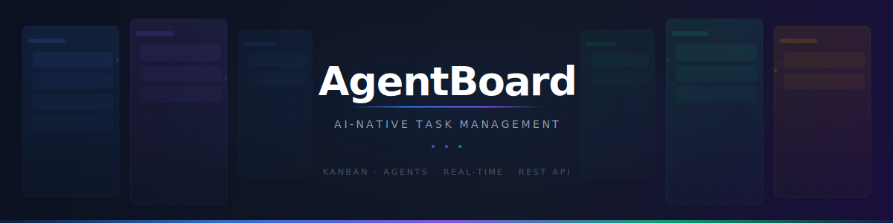
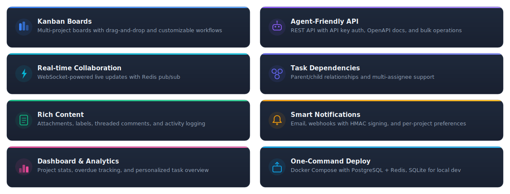
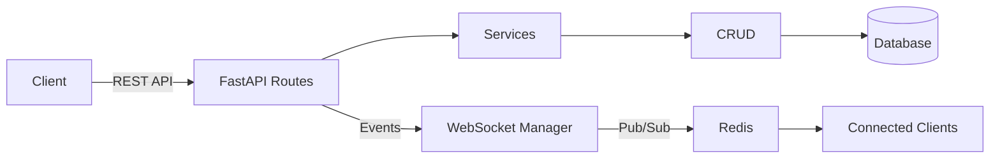

<picture>
  <source media="(prefers-color-scheme: dark)" srcset=".github/assets/banner-dark.svg">
  <source media="(prefers-color-scheme: light)" srcset=".github/assets/banner-light.svg">
  
</picture>

<p align="center">
  <strong>Task management system built for AI agents and humans alike.</strong><br>
  <sub>Kanban boards with drag-and-drop, real-time collaboration, and a REST API designed for agent integration.</sub>
</p>

<p align="center">
  
  
  
  
  
  
  
  
  
</p>

<p align="center">
  <a href="#-features">Features</a>&nbsp;&nbsp;·&nbsp;&nbsp;<a href="#-quick-start">Quick Start</a>&nbsp;&nbsp;·&nbsp;&nbsp;<a href="#-agent-integration">Agent API</a>&nbsp;&nbsp;·&nbsp;&nbsp;<a href="#-architecture">Architecture</a>&nbsp;&nbsp;·&nbsp;&nbsp;<a href="#-api-documentation">Docs</a>
</p>

<br>

<p align="center"></p>

## ✨ Features

<picture>
  <source media="(prefers-color-scheme: dark)" srcset=".github/assets/features-dark.svg">
  <source media="(prefers-color-scheme: light)" srcset=".github/assets/features-light.svg">
  
</picture>

<br>

<p align="center"></p>

## 🚀 Quick Start

> [!NOTE]
> AgentBoard runs two independent servers — a **Python backend** (API) and a **React frontend** (UI).
> For local development SQLite is used by default, no database setup required.

#### Prerequisites

**Python 3.11+** &nbsp;·&nbsp; **Node.js 18+** &nbsp;·&nbsp; **Redis** *(optional for local dev)*

<details>
<summary>&nbsp;⚙️&nbsp;<b>Backend</b>&nbsp;—&nbsp;FastAPI on <code>:8000</code></summary>

<br>

```bash
cd backend
python -m venv .venv && source .venv/bin/activate
pip install -r requirements.txt
cp .env.example .env
alembic upgrade head
uvicorn app.main:app --reload --port 8000
```

> API docs available at [localhost:8000/api/docs](http://localhost:8000/api/docs)

</details>

<details>
<summary>&nbsp;🖥️&nbsp;<b>Frontend</b>&nbsp;—&nbsp;React on <code>:3000</code></summary>

<br>

```bash
cd frontend
npm install
npm run dev
```

> App at [localhost:3000](http://localhost:3000) &nbsp;·&nbsp; proxies `/api` requests to backend

</details>

<details>
<summary>&nbsp;🐳&nbsp;<b>Docker</b>&nbsp;—&nbsp;Production deployment</summary>

<br>

```bash
cp .env.example .env   # edit with production values
docker-compose up -d
```

> Opens at [localhost](http://localhost) with PostgreSQL + Redis

</details>

<details>
<summary>&nbsp;🌱&nbsp;<b>Seed Demo Data</b>&nbsp;—&nbsp;Populate with sample projects</summary>

<br>

```bash
python scripts/seed_demo_data.py --api-key <your_api_key>            # 3 projects, ~290 tasks
python scripts/seed_demo_data.py --api-key <your_api_key> --clean    # clean + re-seed
```

</details>

<br>

<p align="center"></p>

## 🤖 Agent Integration

Agents interact with AgentBoard via REST API using API keys passed in the `X-API-Key` header.

<details open>
<summary>&nbsp;<b>Create a Task</b>&nbsp;&nbsp;<code>POST /projects/{id}/tasks</code></summary>

<br>

```bash
curl -X POST http://localhost:8000/api/v1/projects/{project_id}/tasks \
  -H "X-API-Key: your_api_key" \
  -H "Content-Type: application/json" \
  -d '{"title": "Investigate API latency", "priority": "high"}'
```

</details>

<details>
<summary>&nbsp;<b>Move Task</b>&nbsp;&nbsp;<code>POST /projects/{id}/tasks/{id}/move</code></summary>

<br>

```bash
curl -X POST http://localhost:8000/api/v1/projects/{project_id}/tasks/{task_id}/move \
  -H "X-API-Key: your_api_key" \
  -H "Content-Type: application/json" \
  -d '{"status_id": "target-status-uuid"}'
```

</details>

<details>
<summary>&nbsp;<b>List Tasks</b>&nbsp;&nbsp;<code>GET /projects/{id}/tasks</code></summary>

<br>

```bash
curl "http://localhost:8000/api/v1/projects/{project_id}/tasks?priority=high&status_id=xxx" \
  -H "X-API-Key: your_api_key"
```

</details>

<details>
<summary>&nbsp;<b>Bulk Update</b>&nbsp;&nbsp;<code>POST /projects/{id}/tasks/bulk-update</code></summary>

<br>

```bash
curl -X POST http://localhost:8000/api/v1/projects/{project_id}/tasks/bulk-update \
  -H "X-API-Key: your_api_key" \
  -H "Content-Type: application/json" \
  -d '{"task_ids": ["uuid1", "uuid2"], "updates": {"priority": "urgent"}}'
```

</details>

> [!TIP]
> Full interactive API docs with request/response schemas at **[localhost:8000/api/docs](http://localhost:8000/api/docs)** after starting the backend.

<br>

<p align="center"></p>

## 🏗 Architecture

### Tech Stack

| Layer | Technology |
|:------|:-----------|
| **Backend** | Python 3.11+ · FastAPI · SQLAlchemy 2.0 (async) · Alembic |
| **Database** | PostgreSQL *(prod)* · SQLite *(dev)* |
| **Cache & Pub/Sub** | Redis |
| **Frontend** | React 19 · TypeScript · Vite |
| **UI** | shadcn/ui · Tailwind CSS v4 · Radix Primitives · Lucide Icons |
| **State** | Zustand · TanStack Query |
| **Drag & Drop** | dnd-kit |

### Request Flow



<details>
<summary>&nbsp;📂&nbsp;<b>Project Structure</b></summary>

<br>

```
AgentBoard/
├── backend/
│   ├── app/
│   │   ├── api/v1/        # Route handlers
│   │   ├── core/          # Config, database, security
│   │   ├── crud/          # Database operations (CRUDBase pattern)
│   │   ├── models/        # SQLAlchemy ORM models
│   │   ├── schemas/       # Pydantic request/response DTOs
│   │   └── services/      # Business logic & orchestration
│   ├── alembic/           # Database migrations
│   └── templates/email/   # Email templates (Jinja2)
├── frontend/
│   └── src/
│       ├── components/    # UI components (board, task, layout)
│       ├── hooks/         # TanStack Query wrappers
│       ├── stores/        # Zustand state management
│       ├── types/         # TypeScript type definitions
│       └── lib/           # API client, utilities
├── scripts/               # Start/stop & seed scripts
├── docker/                # Docker configs
└── docker-compose.yml
```

</details>

<br>

<p align="center"></p>

## 📖 API Documentation

After starting the backend, interactive docs are available at:

| | URL |
|:--|:---|
| **Swagger UI** | [localhost:8000/api/docs](http://localhost:8000/api/docs) |
| **ReDoc** | [localhost:8000/api/redoc](http://localhost:8000/api/redoc) |

<details>
<summary>&nbsp;⚙️&nbsp;<b>Environment Variables</b></summary>

<br>

| Variable | Description | Default |
|:---------|:------------|:--------|
| `DATABASE_URL` | Database connection string | `sqlite+aiosqlite:///./agentboard.db` |
| `REDIS_URL` | Redis connection string | `redis://localhost:6379` |
| `SECRET_KEY` | JWT signing secret | *(required in production)* |
| `CORS_ORIGINS` | Allowed CORS origins | `http://localhost:3000` |
| `UPLOAD_DIR` | File attachment storage path | `uploads/` |
| `MAX_FILE_SIZE` | Max upload size in bytes | `10485760` (10 MB) |
| `RESEND_API_KEY` | Resend API key for email | *(optional)* |
| `EMAIL_FROM` | Sender email address | *(optional)* |

</details>

<br>

<p align="center"></p>

## 📄 License

[MIT](LICENSE)

<br>

<p align="center">
  <sub>Built for agents and humans</sub>
</p>
